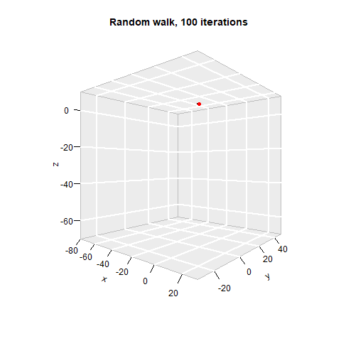

# Instructions : 

* Install the package rmdformats by running :
install.packages("rmdformats")

* Make sure to install all the packages necessary, including :
ggmap, rworldmap, rworldxtra, magriits, ptsdpkg, mapproj, plotly, tidytext, readxl, plot3D, animation and knitr

* The program is slow to run because of the management of a large number of data and of the utilisation of a web scraping method, you can however access the report in its compiled html format in the folder "reports"


```{r,warning = FALSE, message = FALSE, echo=FALSE}
library("rmdformats")
library("rworldmap")
library("rworldxtra")
library("ggmap")
library("tidyverse")
library("magrittr")
library("ptdspkg")
library("mapproj")
library("plotly")
library("tidytext")
library("readxl")
library("tibble")
library("ggplot2")
library("dplyr")
library("plot3D")
library("animation")
library("knitr")
library("kableExtra")
library("ggrepel")
library("future")
library("quantmod")
library("rvest")
library("tidyr")


```
# Problem 1: Fuzz Bizz

```{r,warning = FALSE, message = FALSE, echo=FALSE}

# Creation of the "FuzzBizz" operation
i <- 1
df <- data.frame()
while (i<=1000)  {
  if ((i%%5==0) & (i%%3==0)) {
    df <- rbind(df,c("FuzzBizz"))
  } else if (i%%5==0){
    df <- rbind(df,c("Bizz"))
  } else if (i%%3==0) {
    df <- rbind(df,c("Fuzz"))
  } else {
    df <- rbind(df,c(i))
  }
  i <- i+1
}


df2 <- NULL
for (i in seq(10, nrow(df), 10)){
  df2 <- rbind(df2, df[(i-9):i,])
}


df2 %>%
  kable(row.names=FALSE,align = "c") %>%
  kable_styling(bootstrap_options = c("striped", "hover", "condensed", "bordered", font_size = 7))

```


# Problem 2: Map

```{r echo=FALSE, message=FALSE, warning=FALSE, results='hide', fig.keep='all'}

cities <- tibble(
  name = c("zurich", "bern", "lausanne", "geneva", "basel"),
  language = c("german", "german", "french", "french", "german"),
  latitude = c(47.369019, 46.948002, 46.519630, 46.204391, 47.559608),
  longitude = c(8.538030, 7.448130, 6.632130, 6.143158, 7.580610)
)

# Scrap prices from comparis.ch using ptdspkg::get_volume()
#-------------------------------------------------------------------------------

cities <- cities %>%
  mutate(volume = sapply(name, get_volume))

# Draw the map
#-------------------------------------------------------------------------------

world_map <- getMap(resolution = "high")

which(sapply(1:243, function(x) world_map@polygons[[x]]@ID) == "Switzerland")

switzerland <- world_map@polygons[[40]]@Polygons[[1]]@coords %>% as_tibble()

#creation of the plot

ggplot() +
  geom_polygon(data = switzerland, aes(x=V1, y = V2), fill= NA, color = "black")+
  geom_point( data= cities, aes(x=longitude, y=latitude, size=volume, color=language))+
  coord_map()+
  theme(panel.background = element_rect(fill= NA, colour="darkgrey", linetype="solid"))+
  xlab("Longitude")+
  ylab("Latitude")+
  scale_size_continuous(name = "Volume", range=c(2,8), labels = scales::scientific )+
  scale_color_discrete(name = "Language")+
  labs(title = "Volume of real estate market in Switzerland",
    subtitle = paste("Updated on", as.character(Sys.Date())))+
  guides(size= guide_legend(order = 1),
        color = guide_legend(order = 2))+
  theme(legend.key  = element_rect(fill=NA,
                                  size=0.5))
  
```


# Problem 3: 3-D Random Walk

## Question a :  

We represent a random walk with the package plot 3D. In red is the departure point and in blue is the arrival point of the random walk. In this question we use 10000 iterations. 


```{r, warning = FALSE, message = FALSE, echo=FALSE}

##Question a

###OPTION 2,  time column 

#number of iterations
B <- 10^4
#set seed to have reproductible results 
set.seed(1982)
# create a vector with B numbers that are random. Uniformely distributed between 0 and 1
Ut <- runif(B)

#Create a dataframe with the dimensions x, y and z for the 3D representation and a column for the iteration. 

Xtibble<- tibble ( spaceX=0, spaceY=0, spaceZ=0, iteration=0:B )

#Show tresholds 
tresholds<-c( 1/6 , 2/6 , 3/6 , 4/6 , 5/6 , 6/6 )

#Function that compares the random number from u in the line to the treshold to set the direction 
ft<-function(u, a){
  { if ( u <= a[1] ) {
    direction <- c( 1 , 0 , 0 ) } else if ( u>a[1]&& u<=a[2] ) {
      direction <-c( -1 , 0 , 0 ) } else if ( u>a[2]&& u<=a[3] ){
        direction <- c( 0 , 1 , 0 ) } else if ( u>a[3]&& u<=a[4] ){
          direction <- c( 0 , -1 , 0 ) } else if ( u>a[4]&& u<=a[5] ){
            direction <- c( 0 , 0 , 1 ) } else {
              direction <-c( 0 , 0 , -1 )} }
  
  return( direction )
}

#We go to B+1 because we start the iterations at 0
for( i in 1:B+1 ) { 
  for( j in 1:3 ) {
  Xtibble[ i , j ] = Xtibble[ i-1 , j ] + ft( Ut[ i-1 ] , tresholds )[ j ]}
}
```

```{r,warning = FALSE, message = FALSE, echo=FALSE}

Xtibble[ Xtibble$iteration == B , ]%>%
  kable(col.names=c("x","y","z","iteration"),
        caption="Last coordinates after random walk of 10 000 iterations") %>%
  kable_styling(bootstrap_options = c("striped", "hover", "condensed", font_size = 7), full_width=FALSE)

##Showing departure and arrival, 3D 
#Still needs title and beautifying :) 
pmat <- scatter3D ( Xtibble$spaceX ,
                    Xtibble$spaceY ,
                    Xtibble$spaceZ ,
                    phi = 0 ,
                    bty = "g" ,
                    type = "b" ,
                    ticktype = "detailed" ,
                    pch = 10 , 
                    cex = c(0.1, 0.1, 0.1) , 
                    col="black" ,
                    xlab = " " ,
                    ylab = " " ,
                    zlab=" " ,
                    main = "Random walk, 10 000 iterations " )

points( trans3d( c( Xtibble$spaceX[ 1 ] ,
                    Xtibble$spaceX[ B+1 ] ) , 
                 c( Xtibble$spaceY[ 1 ] , 
                    Xtibble$spaceY[ B+1 ] ) , 
                 c( Xtibble$spaceZ[ 1 ] , 
                    Xtibble$spaceZ[ B+1 ] ) ,
               pmat = pmat ) ,
        col = c( "red" , "blue" ), 
        pch = 16)
```

## Question b :

<p align='justify'>We now do 100 000 iterations. We also modify the tresholds slightly. Ths modification will tweak the directions. Indeed, instead of having the same chance to go up, down, left or right, here there are slightly more chances to go up on the z dimension. </p>


```{r,warning = FALSE, message = FALSE, echo=FALSE}
##part B 

B <- 10^5

set.seed( 2000 )

Ut <- runif( B )

#Same as before but with a column to show the iterations 
Xtibble<- tibble( spaceX=0 ,
                  spaceY=0 ,
                  spaceZ=0 ,
                  iteration = 0:B )

tresholds<-c(1/6,2/6,3/6,4/6,5/6,6/6)

tresholds2<-0.99*tresholds

ft<-function(u, a){
  { if(u<=a[1]){
    direction<- c(1,0,0)}else if(u>a[1]&& u<=a[2]) {
      direction<-c(-1,0,0)}else if (u>a[2]&& u<=a[3] ){
        direction<- c(0,1,0)}else if (u>a[3]&& u<=a[4] ){
          direction<- c(0,-1,0)}else if (u>a[4]&& u<=a[5] ){
            direction<- c(0,0,1)}else{
              direction<-c(0,0,-1)} }
  
  return(direction)
}

for(i in 1:B+1){ 
  for(j in 1:3){
  Xtibble[i,j]=Xtibble[i-1,j]+ft(Ut[i-1],tresholds2)[j]}
}


```

```{r,warning = FALSE, message = FALSE, echo=FALSE}
Xtibble[Xtibble$iteration==B, ]%>%
  kable(col.names=c("x","y","z","iteration"),
        caption="Last coordinates after random walk of 100 000 iterations") %>%
  kable_styling(bootstrap_options = c("striped", "hover", "condensed", font_size = 7), full_width=FALSE)


##Showing departure and arrival, 3D 
#Still needs title and beautifying :) 
pmat<-scatter3D(Xtibble$spaceX, Xtibble$spaceY, Xtibble$spaceZ,phi = 0, bty = "g", type = "b",
          ticktype = "detailed", pch = 10, 
          cex = c(0.1, 0.1, 0.1), col="black"
          )

points(trans3d(c(Xtibble$spaceX[1],Xtibble$spaceX[B+1]),
               c(Xtibble$spaceY[1],Xtibble$spaceY[B+1]),
               c(Xtibble$spaceZ[1],Xtibble$spaceZ[B+1]),
               pmat =pmat ),  col = c("red","blue"), pch = 16)

```

## Bonus:

```{r , fig.show='animate', interval=.1}

a <- function(c) {pmat <- scatter3D ( Xtibble$spaceX[1:c] ,
                                      Xtibble$spaceY[1:c] ,
                                      Xtibble$spaceZ[1:c] ,
                                      phi = 0 ,
                                      bty = "g" ,
                                      type = "b" ,
                                      ticktype = "detailed" ,
                                      pch = 10 , 
                                      cex = c(0.1, 0.1, 0.1) , 
                                      col="black" ,
                                      xlab = "x" ,
                                      ylab = "y" ,
                                      zlab = "z" ,
                                      zlim = c(-70,10),
                                      xlim = c(-80,30),
                                      ylim = c(-30,50),
                                      main = "Random walk, 10 000 iterations " )

points( trans3d( c( Xtibble$spaceX[ 1 ] ,
                    Xtibble$spaceX[ B+1 ] ) , 
                 c( Xtibble$spaceY[ 1 ] , 
                    Xtibble$spaceY[ B+1 ] ) , 
                 c( Xtibble$spaceZ[ 1 ] , 
                    Xtibble$spaceZ[ B+1 ] ) ,
                 pmat = pmat ) ,
        col = c( "red" , "blue" ), 
        pch = 16)}

a(100)
saveGIF(
  for(i in 2:100){
    a(i)
  }, movie.name = "simulation.GIF"
)

```



 


# Problem 4: Portfolio construction

To construct the portfolio we need first to extract the stock data from internet. 

We first exctract the SP500 index tickers from wikipedia. 
```{r, warning=FALSE, message = FALSE, echo=FALSE }

sp500 <- read_html("https://en.wikipedia.org/wiki/List_of_S%26P_500_companies")

#Extract ticker

sp500 %>% 
  html_nodes(".text") %>% 
  html_text() -> ticker_sp500

SP500_symbol <- ticker_sp500[ticker_sp500!= "reports"]
SP500_symbol <- SP500_symbol[1:504]

# Replace "." by "-"
SP500_symbol <- gsub(".","-",SP500_symbol,fixed=T)

kable(as_tibble(head(SP500_symbol)))%>%
  kable_styling(position = "center")


```
Here are the 6 first extracted tickers. We can notice that there is `r length(SP500_symbol)` and not 500. This is becuase there is more thtan 500 companies listed on the sp500. 


We then use those tickers to extract stocks price data from Yahoo. For our model only the daily change in percentage is relevant. So we will exctract only those. 
```{r, warning=FALSE, message = FALSE, echo=FALSE, cache = TRUE, dependson=SP500_symbol }

# Specify timing
tot_length <- 3 * 365
today <- Sys.Date()
seq_three_years <- seq(today,by=-1,length.out=tot_length)
three_year_ago <- seq_three_years[tot_length]

# Retrieve data for all stocks

return.stock<- NULL

for (i in 1:length(SP500_symbol)){
stock_price<-NULL
getSymbols(SP500_symbol[i],from=three_year_ago,to=today)
stock_price <- ClCl(get(SP500_symbol[i]))
stock_price <- stock_price[-1]
colnames(stock_price)<-SP500_symbol[i]
return.stock <- cbind(return.stock, stock_price)
remove(list= SP500_symbol[i])
}

#remove columns that contains NA
return.stock <-return.stock[ , !apply(return.stock,2,function(x) any(is.na(x)))] 

kable(as_tibble(head(return.stock[,1:6])))%>%
  kable_styling(position = "center")

```
Here are few columns of the extracted datas. We can notice that each column is a particular stock and each row is a particular day. The dataframe is only composed of `r ncol(return.stock)` instead of `r length(SP500_symbol)` because some tickers were deleted due to the fact that after scrapping they contained some NA entries. This is because some companies were listed on the sp500 less than 3 years ago. 


```{r, cache=TRUE,echo= FALSE, warning=FALSE}

return.stock <- data.frame(return.stock)

#Create the variables that are needed for the calculation. 

mean.return <- data.frame("mean.return" = apply(return.stock,2,function(x) mean(x)))
mean.return<-cbind("Company"= rownames(mean.return),mean.return)
mean.return<- do.call(cbind.data.frame,Map(expand.grid,company.1=mean.return, company.2=mean.return))
mean.return<-mean.return %>% rename(
    Company.1 = Company.company.1,
    Company.2 = Company.company.2
    )


sd.return <- data.frame("sd.return" = apply(return.stock,2,function(x) sd(x)))
sd.return<-cbind("Company"= rownames(sd.return),sd.return)
sd.return<- do.call(cbind.data.frame,Map(expand.grid,company.1=sd.return, company.2=sd.return))
sd.return<- sd.return %>% rename(
    Company.1 = Company.company.1,
    Company.2 = Company.company.2
    )

cov.return <- data.frame(cov(return.stock))
cov.return<-cbind("Company.1"=rep(colnames(return.stock), 499) ,gather(cov.return,"Company.2", "Cov", na.rm = FALSE, convert = FALSE))


#We merge all clean database 
return.clean <- left_join(mean.return,sd.return) %>% left_join(cov.return) %>% filter(Company.1!=Company.2) %>% dplyr::distinct(Cov, .keep_all = TRUE) #delete double entries. 

kable(as_tibble(head(return.clean[,])))%>%
  kable_styling(position = "center")


```
The datas after preparation have 7 columns: a pair of tickers, their daily return, their standard deviation and the covariance. The data frame have `r nrow(return.clean)` which is the expected number if we combine all the possible pairs of tickers following this equation : $$ \frac{n(n-1)}{2}$$


Now to find the expected return and covariance we will use two functions : 

$$Portfolio\; expected \;return: \;\;\;\;\;\;  \mathbb{E}(R_p)= w\mathbb{E}(R_{i}) + (1-w)\mathbb{E}(R_{j}) $$
$$Portfolio \;return \; variance: \;\;\;\;\;\;  \sigma^2_p = w^2\sigma^2_i + (1-w)^2\sigma^2_j + 2w(1-w)\sigma_i\sigma_j\rho_{ij}  $$

To facilitate calculations the weight will not be continuous but distrtibuted between 0 and 1 in sequence of 0.1. 

```{r, cache=TRUE, echo= FALSE,warning=FALSE}


return.clean.matrix <- data.matrix(return.clean[3:7], rownames.force = NA) #transform in a matrix to ease computation. 


sigma<- seq(0,1,0.1) #the weight distribution vector 


esp_return <- function(i,x){return.clean.matrix[i,1]*x+return.clean.matrix[i,2]*(1-x)}

risk <- function(i,x){sqrt(return.clean.matrix[i,3]^2*x^2+return.clean.matrix[i,4]^2*(1-x)^2+
                             2*x*(1-x)*return.clean.matrix[i,5])}


#daily_return <- cbind(return.clean[,1:2],setNames(data.frame(matrix(ncol = 11, nrow = nrow(return.clean))), as.character(sigma)))


```

For the heavy calculation of running the function 11 times over all the `r nrow(return.clean.matrix)`rows the package future was used to distribute the calculation amongst different cores. 

```{r, cache=TRUE, echo= FALSE, warning=FALSE}


plan(multiprocess)


a %<-% {
  ret1<-NULL
  for (i in 1:50000){
  ret.a<-NULL
  ret.a<-esp_return(i, sigma)
  ret1<- rbind(ret1,ret.a)
  } 
  return(ret1)
}

b %<-% { 
  ret2<-NULL
  for (i in 50001:100000){
  ret.b<-NULL
  ret.b<-esp_return(i, sigma)
  ret2<- rbind(ret2,ret.b)
  }
return(ret2)
}

c %<-% {
  ret3<-NULL
  for (i in 100001:nrow(return.clean.matrix)
){
  ret.c<-NULL
  ret.c<-esp_return(i, sigma)
  ret3<- rbind(ret3,ret.c)
  } 
  return(ret3)
}


final.return <- rbind(a,b,c)


```

```{r, cache=TRUE, echo= FALSE, warning=FALSE}


a %<-% {
  ret1<-NULL
  for (i in 1:50000){
  ret.a<-NULL
  ret.a<-risk(i, sigma)
  ret1<- rbind(ret1,ret.a)
  } 
  return(ret1)
}

b %<-% { 
  ret2<-NULL
  for (i in 50001:100000){
  ret.b<-NULL
  ret.b<-risk(i, sigma)
  ret2<- rbind(ret2,ret.b)
  }
return(ret2)
}

c %<-% {
  ret3<-NULL
  for (i in 100001:nrow(return.clean.matrix)){
  ret.c<-NULL
  ret.c<-risk(i, sigma)
  ret3<- rbind(ret3,ret.c)
  } 
  return(ret3)
}


final.sd <- rbind(a,b,c)


```


```{r, cache=TRUE, echo= FALSE, warning=FALSE}


All.portfolio <- data.frame("company.1" = return.clean$Company.1,"company.2" = return.clean$Company.2, "Return" = final.return, "Sd" = final.sd)

names(All.portfolio) <- c("company.1", "company.2", paste0("R",".",sigma),paste0("SD",".",sigma))


All.portfolio.long <- cbind(gather(All.portfolio[,1:13],Weight.Company.1 , Return , R.0:R.1, factor_key=TRUE),  "SD" =gather(All.portfolio[,c(1:2,14:24)],Portfolio, SD , SD.0:SD.1, factor_key=TRUE)[,4])  #put in long format to find min. 


lowerSD.portfolio <- All.portfolio.long[All.portfolio.long[,5] == min(All.portfolio.long[,5]),]

lowerSD.portfolio$Weight.Company.1 <-gsub('R.', '', lowerSD.portfolio$Weight.Company.1)


kable(round(lowerSD.portfolio$SD, digits = 4)*1000000)%>%
  kable_styling(position = "center")

```


```{r echo=FALSE, message=FALSE, warning=FALSE, results='hide', fig.keep='all'}


theme_set(theme_bw())


df<- data.frame("company.1" = return.clean$Company.1,"company.2" = return.clean$Company.2, "Variance" = final.sd[,5], "ret" = final.return[,5])

df %>% mutate("Min" = (min(Variance) == Variance ))  %>% mutate(Portfolio = ifelse(Min == TRUE, as.character(paste(company.1,company.2,sep = "-")), NA)) -> df


ggplot(df, aes(Variance, ret, color = Min, alpha = Min))+
  scale_color_discrete(name = NULL, labels = c("Autre Portfolio", "Min variance Portfolio")) +
  scale_alpha_manual(values = c(0.01,1), guide=FALSE)+ ylab("Return")+xlab("Standard-deviation")+
  ggtitle("Return and SD of all portfolios with a weight distribution of \n  0.4 and 0.6 for each stock respectively")+
  theme(plot.title = element_text(hjust = 0.5))+
  geom_label(label = df$Portfolio, 
    nudge_x = 0.00 , nudge_y = 0.0002, 
    check_overlap = F, size = 2,
    color = "#00AFBB",fontface = "bold")+
    geom_point()

```


After anaylsis the portfolio with the lower standard-deviation is composed of the ticker `r lowerSD.portfolio$company.1` and `r lowerSD.portfolio$company.2` with a weight of `r lowerSD.portfolio$Weight.Company.1` and `r (1-as.numeric(lowerSD.portfolio$Weight.Company.1))` respectively. The standard deviation of this portfolio is `r round(lowerSD.portfolio$SD, digits = 4)`% and the daily expected return is `r round(lowerSD.portfolio$Return, digits = 4)`%. 

With one milion invested in this portfolio the daily expected return would be `r round(lowerSD.portfolio$Return, digits = 4)*1000000`$. 


